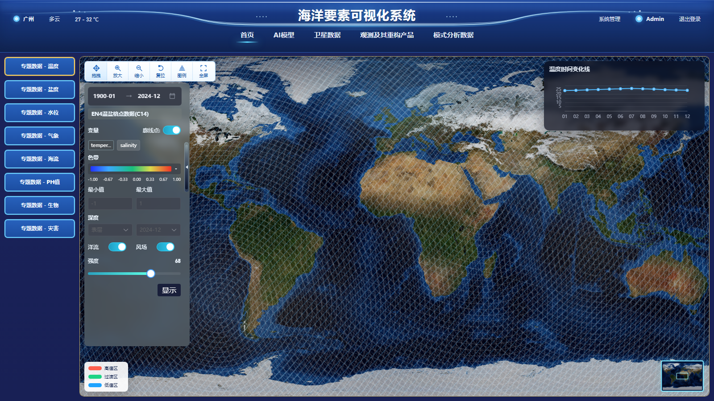

# 海洋要素可视化首页原型还原

这是一个基于 `Vue 3 + TypeScript + Vite + Element Plus` 的单页前端项目，用于还原海洋要素可视化大屏首页原型。

当前版本目标是：
- 完成首页原型的高保真视觉还原
- 使用本地 `mock` 数据驱动页面展示与交互
- 预留后端接口接入位置
- 暂不接入真实 GIS / Cesium 渲染

## 页面预览



## 技术栈

- Vue 3
- TypeScript
- Vite
- Element Plus
- ECharts
- Sass

## 功能说明

当前已实现：
- 顶部大屏头部 UI 还原
- 左侧专题切换
- 地图舞台静态底图展示
- 地图工具栏交互
- 左侧图层筛选面板交互
- 右上趋势折线图联动
- 左下图例展示
- 右下缩略图联动
- 系统管理骨架页占位
- 登录 / 退出登录前端交互逻辑

当前说明：
- 页面主要用于“原型还原”和“前端交互演示”
- 地图区域目前不依赖真实 GIS 服务
- 数据来自 `src/mock` 中的本地模拟数据

## 本地启动

安装依赖：

```bash
npm install
```

启动开发环境：

```bash
npm run dev
```

类型检查：

```bash
npm run type-check
```

生产构建：

```bash
npm run build
```

构建预览：

```bash
npm run preview
```

## 目录结构

```text
src/
  assets/        静态资源
  components/    页面组件
  config/        运行配置
  mock/          本地模拟数据
  services/      接口占位与交互同步逻辑
  styles/        全局样式与设计 token
  types/         类型定义
  views/         页面视图
```

## 当前仓库状态

当前 GitHub 仓库已经包含本地启动所需的源码、依赖清单和运行资源。

也就是说：
- 仓库代码拉取后可以执行 `npm install`
- 安装完成后可以执行 `npm run dev`
- 启动后的页面效果应与当前本地项目保持一致

注意：
- `node_modules` 不在仓库中，需要拉取后本地安装依赖
- 一些未使用的大体积原始地图源文件没有提交到仓库，这是为了避免 GitHub 文件大小限制
- 当前页面效果依赖仓库内已经提交的底图资源，不影响本地启动和展示

## 后续可扩展方向

- 接入真实后端接口
- 接入真实 GIS / Cesium 地图能力
- 增加更多专题页数据联动
- 补充系统管理与登录完整流程
